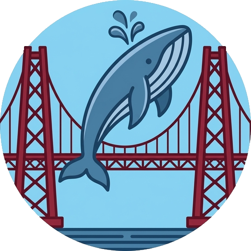

<div align="center">
  

  <h1>Whale Bridge</h1>

  <p><strong>Компаньон DeepSeek для работы с локальными проектами.</strong></p>

  <p>
    Бесплатное приложение с открытым исходным кодом для Windows, которое размещает веб-интерфейс DeepSeek
    рядом с локальным проектом и превращает ответы ИИ с кодом в проверяемые и безопасные изменения файлов.
  </p>
</div>

---

## Что такое Whale Bridge?

Whale Bridge — это настольное приложение на Electron для разработчиков, которые используют **веб-интерфейс DeepSeek** при работе с локальным проектом.

Оно объединяет два инструмента в одном окне:

- **DeepSeek слева** — обычный веб-интерфейс, включая вашу учётную запись и чаты.
- **Whale Bridge справа** — дерево локального проекта, конструктор промптов, предлагаемые изменения, Diff, историю и инструменты отката.

Главная идея проста: **DeepSeek предлагает код, но Whale Bridge не записывает его на диск вслепую.**

Приложение разбирает поддерживаемые блоки кода на странице DeepSeek, сопоставляет их с локальными файлами, показывает получившийся Diff и применяет изменение только после вашего подтверждения.

### Что умеет

- Связывает веб-интерфейс DeepSeek с локальной папкой проекта.
- Встроенный редактор кода на Monaco с деревом проекта, вкладками и подсветкой GDScript.
- Ручные правки сохраняются через тот же безопасный путь, что и предложения ИИ, и попадают в историю как `manual`.
- Отслеживает, какую версию каждого файла знает модель, и подсвечивает файлы, о чьих изменениях чат не проинформирован.
- Собирает структурированный первый промпт из выбранных файлов проекта.
- Копирует выбранные файлы и их содержимое в буфер обмена для быстрой передачи контекста.
- Распознаёт изменения целых файлов и частичные правки `SEARCH / REPLACE` или `REPLACE_BLOCK`.
- Поддерживает создание, изменение, удаление и перемещение файлов через явные предложения.
- Показывает Diff до записи изменения.
- Проверяет файл на диске на наличие конфликтов с помощью SHA-256.
- Создаёт резервные копии и хранит историю операций.
- Поддерживает откат изменений.
- Защищает от небезопасных путей, выхода через символические ссылки и ряда распространённых некорректных ответов ИИ.
- Отказывается перезаписывать существующие файлы с некорректной UTF-8-кодировкой, не допуская их незаметного повреждения.

Whale Bridge **не имеет собственной ИИ-модели или бэкенда**. Он работает с уже открытым в приложении веб-сервисом DeepSeek.

---

## Быстрый старт — Windows

### Вариант 1: скачать готовую сборку

Скачайте одну из сборок для Windows со страницы **Releases** репозитория:

- **Installer** — обычная установка Windows с ярлыками в меню «Пуск» и на рабочем столе.
- **Portable** — автономный исполняемый файл, не требующий установки.

Запустите Whale Bridge и войдите в DeepSeek в левой панели.

### Вариант 2: запуск из исходников

Требования:

- Windows, Linux or macOS
- Node.js 20+
- npm

Then:

```bash
npm install
npm start
```

В Windows файл `start.bat` может автоматически установить зависимости и запустить приложение.

Для Linux/macOS:

```bash
./start.sh
```


---

## Как пользоваться

### 1. Откройте DeepSeek

Запустите Whale Bridge и войдите в свою учётную запись DeepSeek в левом веб-представлении.

Whale Bridge не создаёт и не управляет вашей учётной записью DeepSeek. Он лишь отображает веб-интерфейс DeepSeek внутри приложения.

### 2. Добавьте проект

В правой панели нажмите **Добавить папку** и выберите корневую папку проекта.

Выбранный проект связывается с текущим чатом DeepSeek. Эта связь сохраняется локально, поэтому позже можно вернуться к тому же чату.

### 3. Подготовьте первый промпт

Open the **Промпт** tab.

Конструктор промпта может включать:

- the task;
- project context;
- selected files and folders;
- project structure;
- constraints;
- working rules;
- the desired working mode.

Выберите файлы, которые должен видеть DeepSeek, и нажмите **Скопировать промпт**. Вставьте сгенерированный промпт в DeepSeek самостоятельно.

Также можно использовать **Скопировать файлы**, чтобы поместить выбранные файлы и их содержимое в буфер обмена одним компактным блоком контекста.

> Whale Bridge **не вводит текст скрытно** в поле сообщения DeepSeek и не отправляет сообщения от вашего имени. Вы сами решаете, что вставлять и отправлять.

### 4. Попросите DeepSeek изменить проект

Попросите DeepSeek изменить выбранные файлы в соответствии с правилами из сгенерированного промпта.

Whale Bridge отслеживает отображаемый ответ DeepSeek. Поддерживаемые маркеры кода указывают, какому локальному файлу принадлежит блок кода.

For example:

```text
# &src/example.js
```

or for a new file:

```text
# &NEW:src/example.js
```

После завершения ответа правая панель создаёт предложение.

### 5. Проверьте Diff

Откройте предложение и проверьте Diff.

Сам факт генерации кода DeepSeek ничего не записывает в проект.

Нажимайте **Принять изменения** только после проверки результата.

### 6. Отмените изменения

Каждая применённая операция записывается в историю и, где это возможно, защищается резервной копией.

Используйте **↩ Откатить** рядом с файлом или вкладку **История**, чтобы посмотреть предыдущие операции и откатить их.

Откат сам записывается в историю, но **неоткатим**: резервные копии для него не создаются,
чтобы не удваивать их число. На один файл хранится не более двух таких записей.

---

### 7. Правьте файлы во встроенном редакторе

Вкладка **Редактор** — это локальный редактор кода на Monaco: дерево проекта слева, вкладки
открытых файлов сверху, строка состояния снизу.

- Откройте файл кликом в дереве или через **Ctrl+P** (поиск по имени).
- Несохранные изменения отмечены точкой **●** на вкладке и в дереве.
- Если файл изменился вне приложения — отметкой **⚠**.
- **Ctrl+S** сохраняет файл.

Сохранение защищено так же, как применение предложения ИИ: файл проверяется по SHA-256,
создаётся резервная копия, запись атомарная. В историю операция попадает с источником
`manual`, поэтому приложение отличает вашу правку от правки модели и позволяет откатить её
тем же **↩ Откатить**.

Если файл изменился на диске, пока вы его редактировали, **Ctrl+S ничего не запишет** и
предложит три варианта:

- **Показать различия** — версия на диске рядом с вашим буфером;
- **Перезагрузить файл** — перечитать с диска, ваши правки будут потеряны;
- **Сохранить поверх** — перезаписать диск вашей версией. Эта кнопка намеренно не основная
  и требует отдельного подтверждения: чужие изменения будут потеряны безвозвратно.

#### Горячие клавиши

| сочетание | действие |
|---|---|
| `Ctrl+S` | сохранить файл |
| `Ctrl+P` | поиск файла по имени |
| `Ctrl+F` | поиск в файле (Monaco) |
| `Ctrl+W` | закрыть вкладку |
| `Ctrl+Tab` | следующая вкладка |
| `Alt+←` / `Alt+→` | предыдущая/следующая вкладка |
| `F12` | DevTools панели DeepSeek |
| `Ctrl+Shift+I` | DevTools интерфейса Whale Bridge |

Клавиши работают, когда фокус в интерфейсе Whale Bridge. Если фокус в панели DeepSeek,
клавиатура уходит странице DeepSeek — это ограничение встраивания веб-интерфейса, поэтому
`F12` и `Ctrl+Shift+I` вынесены в меню Electron и работают всегда.

`Ctrl+Shift+S` (Save As) пока не реализован.

---

### 8. Что знает модель

Файл меняется не только через Whale Bridge: его правите вы в другом редакторе или в нашем,
восстанавливает откат, трогает сборка или система контроля версий. В этот момент модель
продолжает считать актуальной ту версию, которую видела раньше, и предлагает правки от
устаревшего кода — блоки `SEARCH` перестают находиться, а автоправки ломаются.

Поэтому приложение ведёт **журнал контекста**: какую версию какого файла знает модель
в текущем чате. Расхождение — это несовпадение того, что сейчас на диске, с последней
версией, которую модель видела.

Модель считает знающей версию, когда:

- вы **применили её предложение** — содержимое получено от неё (для перемещения файла
  отмечается новый путь);
- файл ушёл ей как контекст через **«Скопировать файлы»** в конструкторе промпта;
- вы **подтвердили вручную** — «✓ Модель проинформирована».

**«Скопировать актуальные версии для модели» предупреждения не снимает**: скопировать
в буфер — не значит отправить в чат, а ложное «модель знает» хуже заметного, потому что
скрывает уехавший контекст. Отметку ставит только явное действие.

Отметка хранится как SHA-256 содержимого, а не как флаг. Отсюда два свойства: следующее
изменение файла снимает её само, и её нельзя «забыть» снять — она привязана к содержимому,
а не к действию пользователя.

Журнал привязан к **чату**, а не к папке: в одном проекте может быть несколько чатов,
и в каждом модель знает своё. Журнал хранится в конфигурации и **переживает перезапуск** —
учёт контекста, который обнуляется вместе с сессией, смысла не имеет.

Файл, которого в журнале нет, расхождением не считается: модель его никогда не видела,
и сравнивать не с чем. Иначе подсвечивался бы весь проект и отметка обесценилась бы.

#### Где это видно

| место | отметка |
|---|---|
| вкладка **Редактор**, дерево и вкладки | `◆` — модель не знает текущую версию |
| вкладка **Редактор**, строка состояния | бейдж «модель не знает» и кнопка «✓ Модель знает» |
| вкладка **Файлы** | жёлтая строка, `⚠ изменён`, сводка сверху |
| карточка предложения | бейдж «изменён вручную» и предупреждение в Diff |

Клик по `⚠ изменён` открывает сравнение последней известной модели версии с текущим файлом.

#### Старые ответы модели

При прокрутке чата вверх DeepSeek догружает старые сообщения, и их блоки кода раньше
предлагались как свежие правки. Теперь приложение помнит, какие блоки уже разбирало
в этом чате, и такие предложения попадают в раздел «Показывать код из истории чата»,
а не в основной список.

#### Сравнение с версией модели

Клик по `⚠ изменён` показывает, что именно изменилось: слева версия, которую видела
модель, справа текущий файл. Для этого журнал хранит не только хэш, но и **снимок
содержимого** — в `context/` рядом с резервными копиями, адресуемый по хэшу, поэтому
одинаковое содержимое разных файлов хранится один раз.

Снимок не сохраняется для версий больше ~1 МБ текста, и всего их хранится не больше 300:
вытесняются только те, на которые журнал больше не ссылается. Если снимка нет, сравнение
строится от резервной копии последней операции, и это оговаривается явно.

---

## Поддерживаемые форматы правок

### Полный файл

Для полного файла DeepSeek может вернуть содержимое под маркером его пути:

```text
# &src/example.py
print("Hello")
```

Для нового файла:

```text
# &NEW:src/example.py
print("Hello")
```

### REPLACE_BLOCK

Используйте этот формат для замены целой функции, метода или класса без передачи всего файла:

```text
# &src/example.py
<<<<<<< REPLACE_BLOCK
def main():
    print("new version")
>>>>>>> REPLACE_BLOCK
```

Whale Bridge находит соответствующую функцию/метод/класс в текущем файле и заменяет этот блок.

### SEARCH / REPLACE

Используйте этот формат для небольшой точечной правки:

```text
# &src/example.py
<<<<<<< SEARCH
old code
=======
new code
>>>>>>> REPLACE
```

Искомый текст должен точно соответствовать одному месту в файле. Неоднозначные или отсутствующие совпадения отклоняются — приложение не пытается угадывать.

### Удаление файла

```text
# &DELETE:src/old_file.py
```

### Перемещение файла

```text
# &MOVE:src/old_file.py -> src/new_file.py
```

Для операций удаления и перемещения не требуется перезаписывать содержимое файла.

---

## Модель безопасности

При применении изменений, сгенерированных ИИ, Whale Bridge намеренно действует консервативно.

Перед записью файла он проверяет, среди прочего:

- path traversal such as `..`;
- absolute paths;
- attempts to escape through symlinks;
- `.git` and other protected paths;
- valid operation type (`create`, `update`, `delete`, `move`);
- SHA-256 conflict between the file used to build the proposal and the current file on disk;
- incomplete or obviously truncated AI responses;
- ambiguous `SEARCH / REPLACE` matches;
- invalid UTF-8 when an existing file would be rewritten.

Там, где это уместно, запись выполняется через резервную копию, временный файл и атомарную замену.

Цель не в том, чтобы автоматически сделать код, сгенерированный ИИ, правильным. Цель — сделать **изменения файлов с помощью ИИ проверяемыми и обратимыми**.

---

## Конфиденциальность и передача данных

У Whale Bridge **нет собственного сервера, системы учётных записей или ИИ-бэкенда**.

Приложение локально работает с папкой проекта и встраивает сайт DeepSeek. Для него не нужен API-ключ Whale Bridge.

Однако использование DeepSeek всё равно означает использование стороннего онлайн-сервиса. Если вы вставляете в DeepSeek файлы проекта, код, промпты или другую информацию, эти данные отправляются в DeepSeek в соответствии с применимыми к вам условиями сервиса и учётной записи.

Не вставляйте секреты, пароли, приватные ключи, учётные данные или конфиденциальную информацию, если вы не уверены, что это допустимо.

Сам Whale Bridge не обходит аутентификацию DeepSeek, CAPTCHA, средства контроля доступа или другие механизмы защиты сайта.

---

## Структура проекта

```text
main.js              Главный процесс Electron, окно, DeepSeek WebContentsView и привилегированный IPC
preload-chat.js      Наблюдатель DOM внутри страницы DeepSeek; извлечение данных только для чтения
preload-ui.js        ограниченный IPC-мост для интерфейса Whale Bridge

src/
  parser.js          маркеры ответа и определение формата правок
  patch.js           разбор и применение SEARCH / REPLACE
  promptgen.js       конструктор промпта и дерево проекта
  paths.js           проверки безопасности путей проекта
  diff.js            генерация Diff
  fileops.js         чтение, запись, резервные копии, откат и операции с файлами
  store.js           локальная конфигурация и история
  proposals.js       жизненный цикл, проверка и применение предложений
  versions.js        модель версий файла: aiBase / disk / saved / editor (общая для main и renderer)
  editorfs.js        чтение и запись файла из редактора; конфликт сохранения

ui/
  app.js             интерфейс приложения справа
  editor.js          редактор: Monaco, дерево, вкладки, диалог конфликта
  editor-state.js    состояние открытых файлов (чистая логика, покрыта тестами)
  monaco.js          локальная загрузка Monaco и определение языка по расширению
  dom.js             общий помощник создания DOM
  languages/
    gdscript.js      подсветка GDScript (Monarch) и настройки языка
  styles.css         стили интерфейса Whale Bridge
  index.html         оболочка интерфейса

spike/               технический стенд Monaco (CSP, воркеры); в сборку не попадает

tests/               автоматические тесты логики и smoke-тесты интерфейса
assets/              иконки приложения Whale Bridge
```

---

## Сборка релизов для Windows

Whale Bridge использует `electron-builder` для упаковки приложения под Windows.

Собрать установщик и portable-версию:

```bash
npm run build:win
```

Или собрать их отдельно:

```bash
npm run build:win:installer
npm run build:win:portable
```

Готовые артефакты записываются в `release/`.

В проекте также есть вспомогательный `build.bat` для сборки под Windows.

GitHub Actions можно использовать для сборки релизных артефактов из тега версии.

---

## Открытый исходный код и лицензия

**Whale Bridge — бесплатное программное обеспечение с открытым исходным кодом.**

Исходный код Whale Bridge распространяется по **лицензии MIT**. Полный текст лицензии находится в [`LICENSE`](LICENSE).

Вы можете использовать, изучать, изменять и распространять проект в соответствии с этой лицензией и лицензиями его сторонних зависимостей.

Доступные для скачивания сборки Whale Bridge для Windows предоставляются бесплатно. Для работы приложения не требуется платная подписка Whale Bridge, ключ активации или собственный сервер Whale Bridge.

### Стороннее программное обеспечение

Whale Bridge создан с использованием ПО с открытым исходным кодом, включая Electron и electron-builder. Их соответствующие лицензии и уведомления продолжают применяться к этим компонентам.

Whale Bridge **не является** дистрибутивом самого программного обеспечения DeepSeek. Он встраивает и отображает веб-сервис DeepSeek в окне Electron.

---

## Отказ от принадлежности к DeepSeek и использования товарного знака

**Whale Bridge — независимый неофициальный сторонний проект.**

Whale Bridge **не разработан компанией DeepSeek, не спонсируется ею, не одобрен ею, не связан с ней и не имеет официальной связи с DeepSeek, Hangzhou DeepSeek Artificial Intelligence Co., Ltd., её дочерними компаниями или сервисами.**

Название «DeepSeek» используется в этом README исключительно для точного описания стороннего веб-сервиса, с которым предназначен работать Whale Bridge. Название DeepSeek, логотипы, названия продуктов и другие элементы бренда остаются собственностью соответствующих правообладателей.

Whale Bridge не заявляет о правах собственности на сервис DeepSeek, его сайт, модели, товарные знаки или защищённый контент.

Использование сервиса DeepSeek через Whale Bridge по-прежнему регулируется условиями, правилами и требованиями, применимыми к этому сервису. Пользователи несут ответственность за соблюдение этих условий и применимого законодательства.

**Whale Bridge — это всего лишь независимый настольный компаньон, предоставляющий локальное рабочее пространство вокруг веб-интерфейса DeepSeek.**

---

## Отказ от ответственности

Whale Bridge предоставляется **«как есть»**, без каких-либо гарантий в той мере, в какой это допускается применимым законодательством.

Код, сгенерированный ИИ, может быть неправильным, небезопасным, неполным или несовместимым с вашим проектом. Всегда проверяйте и тестируйте изменения перед использованием в production.

Whale Bridge не гарантирует доступность, точность, надёжность или постоянную совместимость с веб-сервисом DeepSeek. Изменения на сайте DeepSeek могут потребовать изменений в DOM-наблюдателе и слое интеграции Whale Bridge.

Ничто в этом README не является юридической консультацией. Если вам требуется консультация по лицензированию, товарным знакам, конфиденциальности, защите данных или конкретному использованию DeepSeek, обратитесь к квалифицированному специалисту.

---

## Если DeepSeek изменит веб-интерфейс

DOM-интеграция зависит от отображаемой страницы DeepSeek. Если DeepSeek изменит разметку, некоторые функции извлечения данных могут перестать работать, пока селекторы не будут обновлены.

Для отладки используйте **Вид → DevTools чата (F12)**.

В качестве запасного варианта можно скопировать ответ DeepSeek и использовать **Взять из буфера**.

---

## Известные ограничения

- Пока нет подсветки синтаксиса и построчного принятия частичных изменений.
- История хранится в JSON, а не в SQLite.
- Некоторые сценарии входа через социальные сети могут не работать во встроенном окне браузера.
- Whale Bridge does not bypass authentication, CAPTCHA or website security controls.
- Совместимость зависит от изменений веб-интерфейса DeepSeek.

---

## Лицензия

MIT — see [`LICENSE`](LICENSE).
